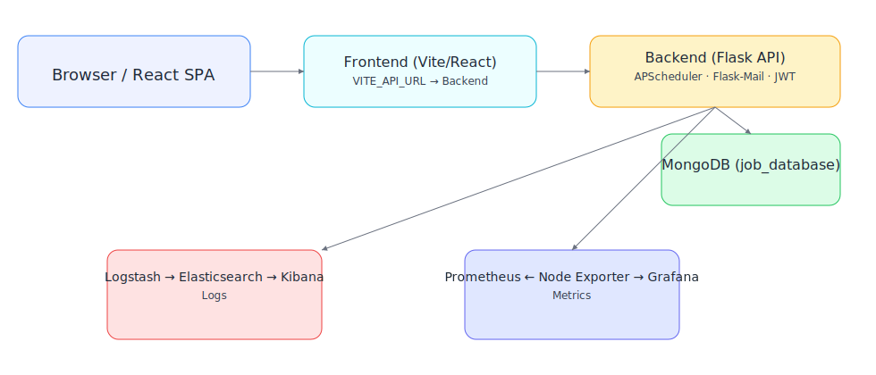

# Project Night Crawler

Ein **Full‑Stack Job‑Crawler** mit React/Vite Frontend, Flask‑Backend und MongoDB.
Ziel: automatisierte Suche und Verwaltung von Stellenanzeigen (u. a. über die Jobbörse der Bundesagentur für Arbeit), inkl. Such‑Alerts, Lesezeichen und E‑Mail‑Benachrichtigungen.

> **Kurzfassung**: React UI → Flask API → MongoDB. CI via GitHub Actions. Deploy per Docker Compose, Azure App Service oder Kubernetes.

---

## Inhaltsverzeichnis

- [Project Night Crawler](#project-night-crawler)
  - [Inhaltsverzeichnis](#inhaltsverzeichnis)
  - [Architektur](#architektur)
  - [Tech‑Stack](#techstack)
  - [Schnellstart](#schnellstart)
    - [Variante A: Docker Compose](#variante-a-docker-compose)
    - [Variante B: Lokal (Dev)](#variante-b-lokal-dev)
  - [Konfiguration \& Umgebungsvariablen](#konfiguration--umgebungsvariablen)
  - [API‑Referenz (Backend)](#apireferenz-backend)
  - [CI/CD](#cicd)
  - [Deployment](#deployment)
    - [Deployment (Azure)](#deployment-azure) 
    - [Docker Images](#docker-images)
    - [Docker Compose](#docker-compose)
    - [Azure App Service](#azure-app-service)
    - [Kubernetes (optional)](#kubernetes-optional)
    - [Deployment (AWS)](#deployment-aws)
    - [Docker Images (Backend & Frontend)](#docker-images-backend--frontend)
    - [Docker Compose (EC2 Deployment)](#docker-compose-ec2-deployment)
    - [AWS EC2](#aws-ec2)
  - [Projektstruktur](#projektstruktur)
  - [FAQ](#faq)
  - [Troubleshooting](#troubleshooting)
  - [Roadmap](#roadmap)
  - [Lizenz](#lizenz)

---

## Architektur



Der Datenfluss: Browser → Vite/React (SPA) → Flask API → MongoDB.  
Side‑Channels: Logs → Logstash → Elasticsearch → Kibana · Metriken via Node Exporter/Prometheus → Grafana.

- Frontend: React (Vite), `VITE_API_URL` zeigt auf das Backend.
- Backend: Flask + APScheduler (Jobs), Flask‑Mail (E‑Mails), JWT Auth, `/health` Endpoint.
- Datenbank: MongoDB (`job_database`, Collections `jobs`, `search_alerts`, `search_results`).
- Observability: ELK + Prometheus/Grafana (siehe `docker-compose.yml`).

## Tech‑Stack

| Ebene        | Technologie(n) |
|--------------|-----------------|
| **Frontend** | React, Vite, React Router, ESLint, Prettier |
| **Backend**  | Python 3.11, Flask, Flask‑CORS, Flask‑Mail, APScheduler, Requests, BeautifulSoup, python‑dotenv |
| **Datenbank**| MongoDB (pymongo) |
| **CI/CD**    | GitHub Actions (Lint, Tests, Docker CI, Deploy) |
| **Container**| Docker, Docker Compose; optional Kubernetes |

---

## Schnellstart

### Variante A: Docker Compose

Voraussetzungen: Docker & Docker Compose installiert.

1. `.env` (im Projekt‑Root) anlegen:

   ```env
   MONGO_URI=mongodb://localhost:27017/nightcrawler
   BAA_API_KEY=jobboerse-jobsuche
   MAIL_SERVER=smtp.example.com
   MAIL_PORT=587
   MAIL_USERNAME=example@example.com
   MAIL_PASSWORD=supersecret
   ```

2. Compose starten:

   ```bash
   docker compose up -d
   ```

3. Öffnen: Frontend → http://localhost:5173  
   Backend → http://localhost:3050 (laut Compose) / ggf. http://localhost:5000 lokal

> Das Compose‑File verwendet die Images `mrrobob/nightcrawler-frontend` und `mrrobob/nightcrawler-backend` und verbindet die Services über `appnet`.

### Variante B: Lokal (Dev)

**Backend** (Python 3.11):

```bash
cd backend
python -m venv .venv && source .venv/bin/activate   # Windows: .venv\Scripts\activate
pip install -r requirements.txt
export MONGO_URI="mongodb://localhost:27017/nightcrawler"
export BAA_API_KEY="jobboerse-jobsuche"
# optional Mail:
export MAIL_SERVER="smtp.example.com"
export MAIL_PORT="587"
export MAIL_USERNAME="example@example.com"
export MAIL_PASSWORD="supersecret"

python server.py
# → läuft auf http://127.0.0.1:5000 (oder gemäß server.py/WEBSITES_PORT)
```

**Frontend** (Node 18+ empfohlen):

```bash
cd frontend
npm install
# API‑URL konfigurieren
echo "VITE_API_URL=http://localhost:5000" > .env.local
npm run dev
# → http://localhost:5173
```

---

## Konfiguration & Umgebungsvariablen

**Backend (.env oder ENV):**

- `MONGO_URI` – MongoDB‑Verbindungsstring
- `BAA_API_KEY` – API‑Key für Jobbörse‑Anfragen
- `MAIL_SERVER`, `MAIL_PORT`, `MAIL_USERNAME`, `MAIL_PASSWORD` – für optionale E‑Mails

**Frontend (.env.local):**

- `VITE_API_URL` – Basis‑URL zum Backend (z. B. `http://localhost:5000` oder `http://backend:3050` im Compose)

Beispiel: `.env.example` im Projekt‑Root.

---

## API‑Referenz (Backend)

| Route | Methoden | Beschreibung |
|------:|:--------:|--------------|
| `/health` | GET | Gesundheitscheck (Monitoring/CI) |
| `/jobsuchen` | GET, POST | Allgemeine Jobsuche |
| `/jobsuchen_baa` | POST | Jobsuche über BAA‑API |
| `/bookmarked_jobs` | GET | Liste der Bookmarks |
| `/update_bookmark` | POST | Bookmark anlegen/aktualisieren |
| `/save_search` | POST | Such‑Alert anlegen |
| `/search_alerts` | GET | Alle Such‑Alerts abrufen |
| `/update_search_alert/<id>` | POST | Such‑Alert aktualisieren |
| `/delete_search_alert/<id>` | DELETE | Such‑Alert löschen |
| `/get_search_results/<alert_id>` | GET | Ergebnisse zu einem Alert abrufen |

Details siehe `backend/server.py`. Datenmodell: `backend/mongodb_connect.py`.

---

## CI/CD

GitHub Actions (Auszug):

- `backend-unit-test.yml` – `pytest` mit Coverage
- `backend-lint-fix.yml` – `flake8`/`black`
- `frontend-lint-fix.yml` – ESLint/Prettier
- `markdown-lint-fix.yml` – Markdown Lint (Auto‑Fix)
- `docker-ci.yml` – Docker Build/Push
- `backend-deploy.yml`, `frontend-deploy.yml` – Azure App Service Deploy

Empfehlung: Workflows als „required checks“ in Branch Protection konfigurieren.

---

## Deployment

### Deployment (Azure)
### Docker Images

- `mrrobob/nightcrawler-backend`
- `mrrobob/nightcrawler-frontend`

### Docker Compose

Siehe `docker-compose.yml` (Ports: Backend 3050, Frontend 5173).

### Azure App Service

Zwei WebApps (Linux): **Backend** und **Frontend**. Deployment via GitHub Actions.

**Secrets (GitHub):**

- `AZUREAPPSERVICE_PUBLISHPROFILE_BACKEND`
- `AZUREAPPSERVICE_PUBLISHPROFILE_FRONTEND`

**Backend WebApp – App Settings:**

- `MONGO_URI`, `JWT_SECRET`, optional `BAA_API_KEY`
- `MAIL_*` Variablen, `PUBLIC_APP_URL` (Produktions‑Frontend‑URL)

**Backend Startup:**

```bash
gunicorn server:app -b 0.0.0.0:${PORT:-3050}
# alternativ: python server.py + WEBSITES_PORT=3050
```

**Frontend WebApp – App Settings:**

- `VITE_API_URL` auf **öffentliche Backend‑URL** setzen (kein localhost)

**CORS/Login Hinweis:**

- Frontend darf in Prod nicht auf `localhost` zeigen. Backend‑CORS muss die öffentliche Frontend‑Domain erlauben.

### Kubernetes (optional)

`all-in-one.yaml` enthält Namespace, Secrets, Deployments und Services für MongoDB, Backend, Frontend.

```bash
kubectl apply -f all-in-one.yaml
kubectl delete all --all -n nightcrawler
```

### Deployment (AWS)

### Docker Images (Backend & Frontend)

- `mrrobob/nightcrawler-backend`  
- `mrrobob/nightcrawler-frontend`

### Docker Compose (EC2 Deployment)

Siehe `docker-compose.yml` (Ports: **Backend 3050**, **Frontend 5173**).

### AWS EC2

Eine einzelne EC2-Instanz (Ubuntu Linux) dient als Host für alle Services.  
Auf der Instanz sind Docker und Docker Compose installiert.  
Das Projekt wird aus GitHub geklont, die .env-Datei enthält alle notwendigen Variablen.  
Die Container für Backend, Frontend und MongoDB werden über `docker compose up -d` gestartet.  
Docker Engine lädt die Images automatisch aus Docker Hub.

**Secrets (.env auf EC2):**

- `MONGO_URI`, `JWT_SECRET`, optional `BAA_API_KEY` 
- `MAIL_*` Variablen, `PUBLIC_APP_URL` (Produktions-Frontend-URL)

**Backend – App Settings:**

- Läuft mit gunicorn auf Port 3050  
- Verbindet sich mit MongoDB Atlas über `MONGO_URI`

**Frontend – App Settings:**

- `VITE_API_URL` zeigt auf die öffentliche Backend-Adresse  
- Keine lokalen URLs verwenden

**CORS/Login Hinweis:**

- Backend-CORS erlaubt ausschließlich die öffentliche Frontend-Domain  
- Frontend darf in Produktion nicht auf `localhost` zeigen

---

## Projektstruktur

```text
├── .github/
│   ├── workflows/
│   │   ├── backend-deploy.yml
│   │   ├── backend-lint-fix.yml
│   │   ├── backend-unit-test.old
│   │   ├── codeql.yml
│   │   ├── docker-ci.yml
│   │   ├── frontend-deploy.yml
│   │   ├── frontend-lint-fix.yml
│   │   ├── markdown-lint-fix.yml
│   │   ├── mongo-backup.yml
│   │   └── trivy-scan.yml
│   └── dependabot.yml
├── backend/
│   ├── tests/
│   │   ├── __init__.py
│   │   ├── conftest.py
│   │   ├── test_crawler_api_baa.py
│   │   ├── test_mongodb_connect.py
│   │   ├── test_server.py
│   │   ├── test_server_additional.py
│   │   └── test_server_crud.py
│   ├── backend_README.md
│   ├── crawl_stepstone.py
│   ├── crawler_api_baa.py
│   ├── Dockerfile
│   ├── mongodb_connect.py
│   ├── requirements.txt
│   └── server.py
├── backups/
│   ├── job_database-2025-09-09/
│   │   └── job_database/
│   │       ├── jobs.bson
│   │       ├── jobs.metadata.json
│   │       ├── prelude.json
│   │       ├── search_alerts.bson
│   │       ├── search_alerts.metadata.json
│   │       ├── search_results.bson
│   │       └── search_results.metadata.json
│   └── search_results.json
├── frontend/
│   ├── src/
│   │   ├── components/
│   │   │   ├── BookmarkedJobs.jsx
│   │   │   ├── FooterLegal.jsx
│   │   │   ├── HeaderBar.jsx
│   │   │   ├── ProtectedRoute.jsx
│   │   │   ├── SearchAlerts.jsx
│   │   │   ├── SearchForm.jsx
│   │   │   ├── SearchResults.jsx
│   │   │   └── Sidebar.jsx
│   │   ├── context/
│   │   │   └── AuthProvider.jsx
│   │   ├── lib/
│   │   │   └── auth.js
│   │   ├── pages/
│   │   │   ├── Datenschutz.jsx
│   │   │   ├── Impressum.jsx
│   │   │   ├── Kontakt.jsx
│   │   │   ├── Landing.jsx
│   │   │   ├── License.jsx
│   │   │   ├── Login.jsx
│   │   │   ├── Register.jsx
│   │   │   ├── RequestReset.jsx
│   │   │   ├── ResetPassword.jsx
│   │   │   └── VerifyEmail.jsx
│   │   ├── App.jsx
│   │   ├── index.css
│   │   └── main.jsx
│   ├── Dockerfile
│   ├── eslint.config.js
│   ├── frontend_README.md
│   ├── index.html
│   ├── package-lock.json
│   ├── package.json
│   └── vite.config.js
├── logstash/
│   └── logstash.conf
├── prometheus/
│   └── prometheus.yml
├── all-in-one.yaml
├── backend-taskdef.json
├── backup-mongo.ps1
├── CONTRIBUTING.md
├── docker-compose.yml
├── LICENSE.md
├── monitor_README.md
└── README.md
```

---

## FAQ

**Was crawlt der Night Crawler?**  
Unter anderem die Jobbörse der Bundesagentur für Arbeit via API; weitere Quellen möglich.

**Wo werden Daten gespeichert?**  
In MongoDB (Sammlungen für Alerts, Ergebnisse, Bookmarks; eindeutige Indizes zur Duplikatvermeidung).

**Wie bekomme ich E‑Mails?**  
Mail‑Server‑Daten in ENV setzen (`MAIL_*`). Das Backend nutzt Flask‑Mail.

**Kann ich die Suche zeitgesteuert laufen lassen?**  
Ja, über APScheduler im Backend oder externe Scheduler.

---

## Troubleshooting

- Backend startet nicht / Port 5000 belegt: Port anpassen (`FLASK_RUN_PORT` oder Code).
- MongoDB‑Verbindung schlägt fehl: `MONGO_URI` prüfen; mit `mongosh` testen.
- CORS‑Fehler: `Flask‑CORS` aktiv und `VITE_API_URL` korrekt?
- Docker Compose: Frontend erreicht Backend nicht → `VITE_API_URL=http://backend:3050` setzen.
- BAA‑API liefert keine Ergebnisse: `BAA_API_KEY` und Parameter prüfen; Logs ansehen.

---

## Roadmap

- Weitere Datenquellen (StepStone et al.)
- UI‑Verbesserungen (Filter, Paginierung, Export)
- Alert‑Scheduling im UI
- Multi‑Arch Docker Images

---

## Lizenz

© 2025 – Roman Smirnov, Project Night Crawler. PolyForm Noncommercial License 1.0.0.
